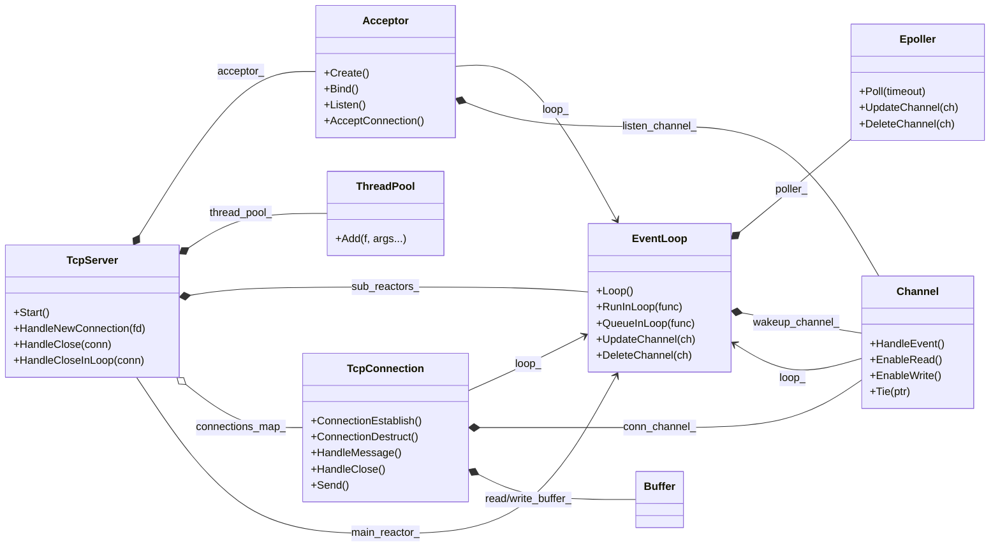

```mermaid
classDiagram
    direction LR

    class TcpServer {
        +Start()
        +HandleNewConnection(fd)
        +HandleClose(conn)
        +HandleCloseInLoop(conn)
    }
    class Acceptor {
        +Create()
        +Bind()
        +Listen()
        +AcceptConnection()
    }
    class EventLoop {
        +Loop()
        +RunInLoop(func)
        +QueueInLoop(func)
        +UpdateChannel(ch)
        +DeleteChannel(ch)
    }
    class Epoller {
        +Poll(timeout)
        +UpdateChannel(ch)
        +DeleteChannel(ch)
    }
    class Channel {
        +HandleEvent()
        +EnableRead()
        +EnableWrite()
        +Tie(ptr)
    }
    class TcpConnection {
        +ConnectionEstablish()
        +ConnectionDestruct()
        +HandleMessage()
        +HandleClose()
        +Send()
    }
    class Buffer
    class ThreadPool {
        +Add(f, args...)
    }

    TcpServer *-- Acceptor : acceptor_
    TcpServer *-- ThreadPool : thread_pool_
    TcpServer *-- EventLoop : sub_reactors_
    TcpServer o-- TcpConnection : connections_map_
    TcpServer --> EventLoop : main_reactor_
    Acceptor --> EventLoop : loop_
    Acceptor *-- Channel : listen_channel_
    EventLoop *-- Epoller : poller_
    EventLoop *-- Channel : wakeup_channel_
    Channel --> EventLoop : loop_
    TcpConnection --> EventLoop : loop_
    TcpConnection *-- Channel : conn_channel_
    TcpConnection *-- Buffer : read/write_buffer_
```