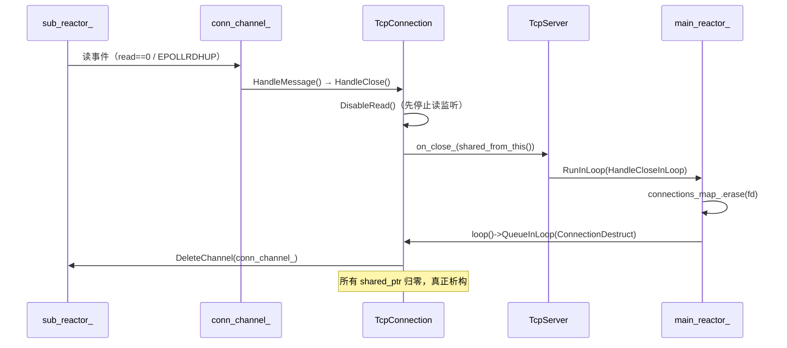

```mermaid
sequenceDiagram
    participant Sub as sub_reactor_
    participant Ch as conn_channel_
    participant Conn as TcpConnection
    participant Srv as TcpServer
    participant Main as main_reactor_

    Sub->>Ch: 读事件（read==0 / EPOLLRDHUP）
    Ch->>Conn: HandleMessage() → HandleClose()
    Conn->>Conn: DisableRead()（先停止读监听）
    Conn->>Srv: on_close_(shared_from_this())
    Srv->>Main: RunInLoop(HandleCloseInLoop)
    Main->>Main: connections_map_.erase(fd)
    Main->>Conn: loop()->QueueInLoop(ConnectionDestruct)
    Conn->>Sub: DeleteChannel(conn_channel_)
    Note over Conn: 所有 shared_ptr 归零，真正析构
```