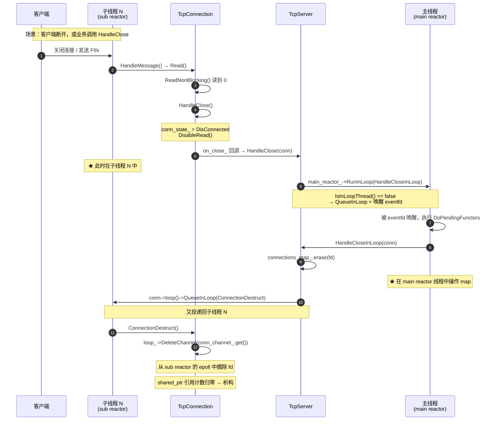

```mermaid
sequenceDiagram
    autonumber
    participant C as 客户端
    participant S as 子线程 N<br/>(sub reactor)
    participant TC as TcpConnection
    participant TS as TcpServer
    participant M as 主线程<br/>(main reactor)

    Note over C,S: 场景：客户端断开，或业务调用 HandleClose
    C->>S: 关闭连接 / 发送 FIN
    S->>TC: HandleMessage() → Read()
    TC->>TC: ReadNonBlocking() 读到 0
    TC->>TC: HandleClose()
    Note over TC: conn_state_ = DisConnected<br/>DisableRead()

    TC->>TS: on_close_ 回调 → HandleClose(conn)
    Note over S: ★ 此时在子线程 N 中

    TS->>M: main_reactor_->RunInLoop(HandleCloseInLoop)
    Note over TS,M: IsInLoopThread() == false<br/>→ QueueInLoop + 唤醒 eventfd

    M->>M: 被 eventfd 唤醒，执行 DoPendingFunctors
    M->>TS: HandleCloseInLoop(conn)
    TS->>TS: connections_map_.erase(fd)
    Note over M: ★ 在 main reactor 线程中操作 map

    TS->>S: conn->loop()->QueueInLoop(ConnectionDestruct)
    Note over TS,S: 又投递回子线程 N

    S->>TC: ConnectionDestruct()
    TC->>TC: loop_->DeleteChannel(conn_channel_.get())
    Note over TC: 从 sub reactor 的 epoll 中摘除 fd
    Note over TC: shared_ptr 引用计数归零 → 析构

```