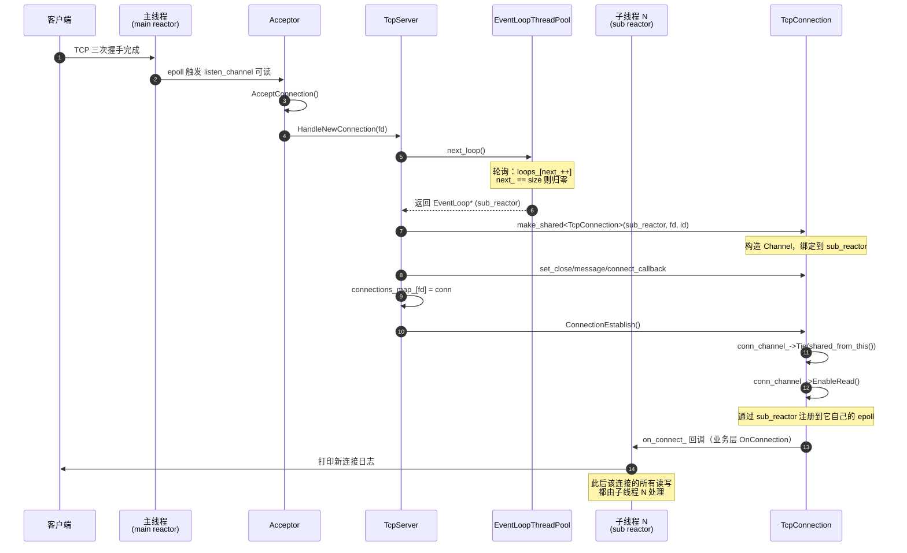

```mermaid
sequenceDiagram
    autonumber
    participant C as 客户端
    participant M as 主线程<br/>(main reactor)
    participant A as Acceptor
    participant TS as TcpServer
    participant P as EventLoopThreadPool
    participant S as 子线程 N<br/>(sub reactor)
    participant TC as TcpConnection

    C->>M: TCP 三次握手完成
    M->>A: epoll 触发 listen_channel 可读
    A->>A: AcceptConnection()
    A->>TS: HandleNewConnection(fd)

    TS->>P: next_loop()
    Note over P: 轮询：loops_[next_++]<br/>next_ == size 则归零
    P-->>TS: 返回 EventLoop* (sub_reactor)

    TS->>TC: make_shared<TcpConnection>(sub_reactor, fd, id)
    Note over TC: 构造 Channel，绑定到 sub_reactor
    TS->>TC: set_close/message/connect_callback
    TS->>TS: connections_map_[fd] = conn
    TS->>TC: ConnectionEstablish()

    TC->>TC: conn_channel_->Tie(shared_from_this())
    TC->>TC: conn_channel_->EnableRead()
    Note over TC: 通过 sub_reactor 注册到它自己的 epoll
    TC->>S: on_connect_ 回调（业务层 OnConnection）
    S->>C: 打印新连接日志

    Note over S: 此后该连接的所有读写<br/>都由子线程 N 处理
```